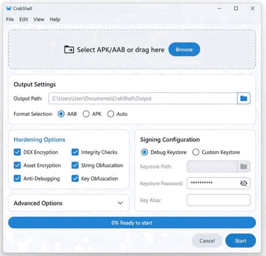

# CrabShell 🦀（Android 加固工具包）


> 面向 APK/AAB 流水线的 Android 加固工具包，提供 Rust 打包器、DEX/native payload 加密与壳运行时引导。



静态预览图： [docs/prototype.png](docs/prototype.png)

**[English README](README.md)** | **[GUI 使用说明](crabshell-gui/README.md)** | **[最新发布](https://github.com/kexuejin/crabshell/releases/latest)**

## 为什么用 CrabShell

- 以目标 APK 作为最终基底，尽量保留原始资源与 Manifest。
- 将 `classes*.dex` 与 `lib/**/*.so` 打包加密为统一 payload，并在运行时解密加载。
- 同时支持 CLI 自动化（CI/CD）与桌面 GUI 操作（Tauri）。

## 快速上手（3 步）

1. 安装依赖：Python 3、Rust、JDK 17+、`apktool`、Android build-tools（`apksigner`）。
2. 执行加固：
   ```bash
   python3 pack.py --target /path/to/your/app.apk --output protected.apk
   ```
3. 安装并验证输出 APK。未传签名参数时，CrabShell 会使用 debug keystore 自动签名。

## 支持范围

| 维度 | 状态 | 说明 |
| --- | --- | --- |
| 输入格式 | APK ✅ / AAB ⚠️ | AAB 能力取决于 bundletool 转换链路和目标应用兼容性。 |
| Android 运行时 | API 24+ ✅ | API 26+ 使用内存 DEX 加载（`InMemoryDexClassLoader`）。 |
| 签名 | Debug 自动签名 ✅ / 自定义签名 ✅ | 支持 `--no-sign` 交给外部流程签名。 |
| 桌面 GUI 打包 | macOS/Linux/Windows ✅ | 由 `.github/workflows/release.yml` 构建。 |

## 功能特性

- **AES-256-GCM 加密**：每次构建生成随机 32 字节密钥，加密原始 DEX 与 native 库。
- **Gen 2 内存加载**：Android 8.0+（API 26+）使用 `InMemoryDexClassLoader` 从内存直接加载 DEX，不落盘。
- **旧系统兼容**：Android 7.x（API 24/25）自动回退到文件加载模式。
- **Multi-DEX 支持**：自动处理多 DEX 应用。
- **Native 库保护**：加密并隐藏 `.so`，仅在运行时按需解密到受保护缓存目录。
- **基础反调试**：JNI 层调试器检测（如 `TracerPid`）。
- **一键自动化**：`pack.py` 统一处理密钥生成、构建、打包、签名。

## 架构说明

项目主要由两部分组成：

1. **Packer（主机侧）**：Rust + Python 流程。
   - 以**目标 APK 作为最终基底**（保留原资源与 Manifest）。
   - 将目标 `classes*.dex` 与 `lib/**/*.so` 加密为 `assets/kapp_payload.bin`。
   - 注入 bootstrap loader dex 与 `libshell.so`。
   - 重新签名输出 APK。

2. **Shell（Android 侧）**：壳应用与运行时加载器。
   - 使用标准 Android 入口（`Application.attachBaseContext`）。
   - 加载 Rust native 库（`libshell.so`）。
   - 从 `assets/kapp_payload.bin` 定位并解密 payload。
   - 在运行时加载原应用代码。

## 环境要求

- **Rust**：[安装 Rust](https://www.rust-lang.org/tools/install)
- **Android NDK**：用于构建 shell 的 native 库。
  - 推荐版本：NDK 26.x
  - 安装 `cargo-ndk`：`cargo install cargo-ndk`
  - 添加目标：`rustup target add aarch64-linux-android armv7-linux-androideabi x86_64-linux-android`
- **Python 3**：用于自动化脚本。
- **JDK 17+**：用于 Android Gradle 构建。
- **apktool**：用于目标 Manifest 补丁与重建。
- **Android build-tools**：`apksigner`（必需），`zipalign`（推荐）。

## 详细安装与使用

### 配置文件（可选）

不想每次都传完整参数时，可创建 `kapp-config.json`：

```json
{
  "target": "my-app.apk",
  "output": "protected.apk",
  "keystore": "release.jks",
  "ks_pass": "password",
  "key_alias": "alias",
  "no_sign": false
}
```

然后执行：

```bash
python3 pack.py
```

### Docker 方式

1. 构建镜像：

```bash
docker build -t crabshell .
```

2. 运行打包：

```bash
docker run --rm -v $(pwd):/app -v /path/to/my-app.apk:/target.apk crabshell \
    python3 pack.py --target /target.apk --output /app/protected.apk
```

### 本地方式

1. 克隆仓库：

```bash
git clone https://github.com/kexuejin/crabshell.git
cd crabshell
```

2. 执行打包：

```bash
python3 pack.py --target /path/to/your/app.apk --output protected.apk
```

首次执行会编译 Rust 与 Gradle 工程，耗时可能较长。

3. 指定签名（可选）：

```bash
python3 pack.py \
    --target app.apk \
    --keystore my-release-key.jks \
    --ks-pass pass:secret \
    --key-alias my-alias
```

若未提供签名参数，脚本默认使用 Android debug keystore（`~/.android/debug.keystore`）自动签名；若不存在会自动生成。

4. 跳过签名（可选）：

```bash
python3 pack.py --target app.apk --output protected.apk --no-sign
```

未签名 APK 通常无法直接安装到设备。

## 手动构建

1. 构建 Packer：

```bash
cd packer && cargo build --release
```

2. 构建 Shell：

```bash
cd loader/app/src/main/rust
cargo ndk -t arm64-v8a -t armeabi-v7a -o ../jniLibs build --release
cd ../../../..
./gradlew assembleRelease
```

## CI / GitHub Actions

工作流文件：`.github/workflows/build.yml`

- `core-build`（Ubuntu）：运行 `verify.sh`，验证非 GUI 主流程（packer + loader）。
- `gui-package`（矩阵）：在桌面三平台构建 Tauri GUI 并上传产物：
  - macOS：`CrabShell.app` + `CrabShell_*.dmg`
  - Linux：`.deb` + `.AppImage`
  - Windows：`.msi` + NSIS `.exe`
- `release.yml`（GUI 发布流程）：
  - tag 触发：`v*`
  - 或手动触发：`workflow_dispatch`（参数：`tag`、`prerelease`）
  - 发布 `.dmg`、`.deb`、`.AppImage`、`.msi`、`.exe` 到 GitHub Releases
  - 发布资产命名为：`CrabShell-<tag>-<original-file-name>`

## 免责声明

本工具仅用于**学习与研究**。请勿用于非法用途。作者不对任何滥用行为负责。

## 许可证

MIT License，详见 [LICENSE](LICENSE)。
